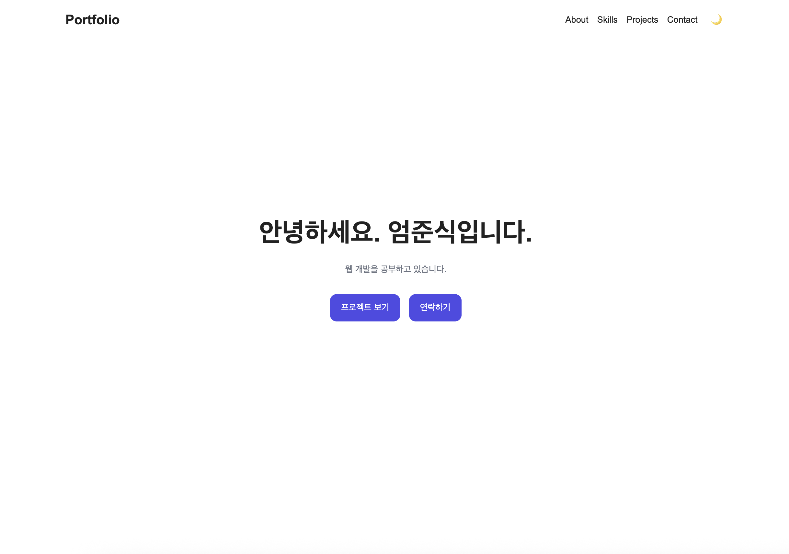
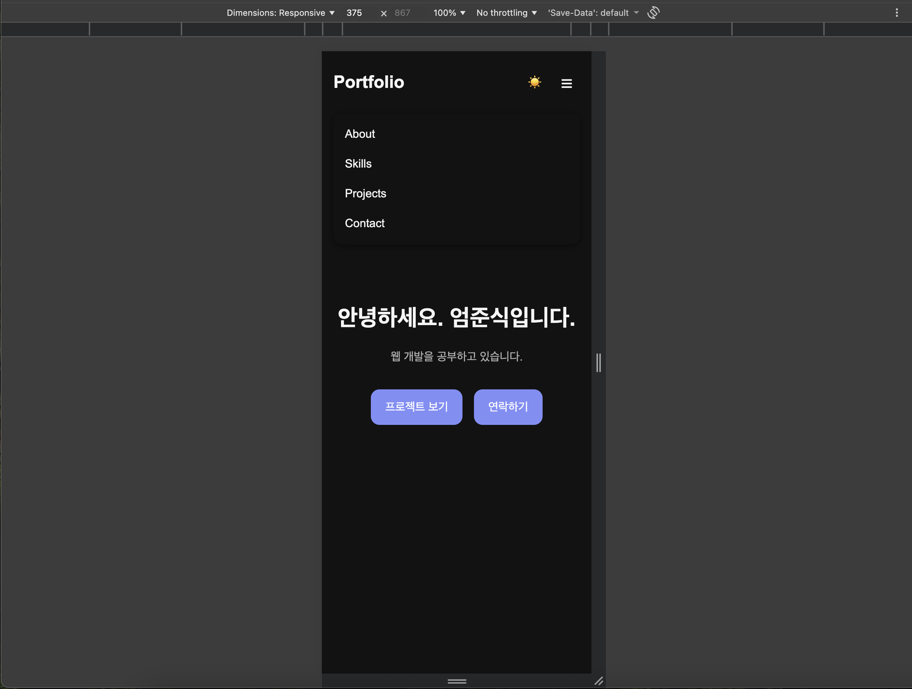
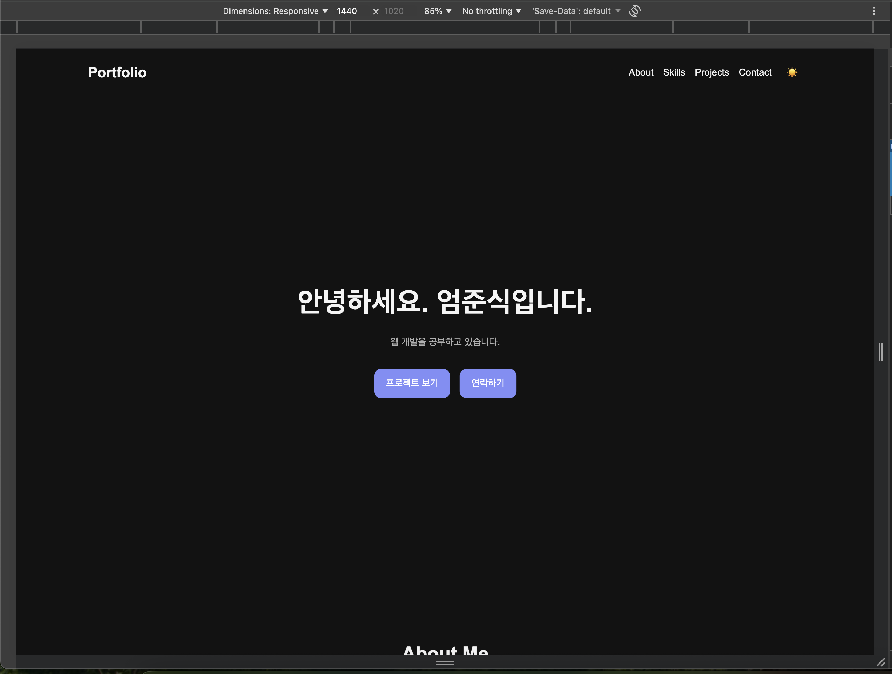

# My Portfolio

순수 **HTML, CSS, JavaScript**만을 사용하여 제작한 반응형 포트폴리오 웹사이트입니다.

프레임워크나 UI 라이브러리 없이 직접 DOM을 조작하고 이벤트를 처리하면서 HTML, CSS, JavaScript의 기본 동작 원리를 학습하는 것을 목표로 제작했습니다.

GitHub REST API를 이용하여 실제 저장소 목록을 가져오며, 프로젝트 언어 필터링, 다크 모드, 폼 유효성 검사, 스크롤 애니메이션 등의 인터랙션을 구현했습니다.

---

## 배포

- GitHub Repository: <https://github.com/Menstear/E2_1_IntroduceMySelf>
- GitHub Pages: <https://menstear.github.io/E2_1_IntroduceMySelf/>

---

## 주요 기능

- 모바일, 태블릿, 데스크톱 반응형 레이아웃
- 모바일 햄버거 메뉴와 키보드 Escape 닫기
- 부드러운 페이지 내부 스크롤
- Scroll Top 버튼과 스크롤 위치에 따른 Header 스타일 변경
- Light / Dark Mode와 `localStorage`를 이용한 설정 유지
- `IntersectionObserver` 기반 반복 등장 애니메이션
- Contact 폼 유효성 검사와 오류·성공 메시지
- GitHub REST API 연동과 Loading / Success / Error / Empty 상태 처리
- GitHub API 수동 재시도
- GitHub 프로젝트 언어별 필터링
- 접근성을 고려한 ARIA 속성 및 키보드 포커스 표시

---

## 사용 기술

| 구분 | 사용 기술 |
|---|---|
| HTML | 시맨틱 마크업, `label`, `alt`, `aria-*` |
| CSS | CSS 변수, Flexbox, Grid, 미디어 쿼리, Transition, Animation |
| JavaScript | ES6+, DOM API, 이벤트 처리, 화살표 함수, 템플릿 리터럴, 구조분해 할당 |
| 배열 처리 | `map()`, `filter()`, `forEach()`, `Set` |
| 비동기 처리 | `fetch()`, `async/await`, `try/catch` |
| 브라우저 API | `localStorage`, `IntersectionObserver`, `matchMedia()` |
| 외부 API | GitHub REST API |

React, Vue, jQuery, Bootstrap, Tailwind CSS 등의 프레임워크와 UI 라이브러리는 사용하지 않았습니다.

주요 시맨틱 태그는 `header`, `nav`, `main`, `section`, `article`, `footer`입니다. 프로젝트 카드의 `article`은 JavaScript에서 동적으로 생성합니다.

---

## 프로젝트 구조

```text
portfolio/
├── index.html
├── README.md
├── .gitignore
├── css/
│   └── style.css
├── js/
│   └── main.js
├── images/
│   └── oiiaoiia.jpeg
└── screenshots/
    ├── desktop.png
    ├── mobile.png
    └── dark-mode.png
```

`index.html`에서 페이지의 구조를 정의하고, `css/style.css`에서 스타일을 관리하며, `js/main.js`에서 이벤트와 상태 변경을 처리합니다.

이미지 파일명과 HTML·README에서 사용하는 상대 경로는 확장자와 대소문자까지 일치해야 합니다. `.DS_Store` 같은 macOS 자동 생성 파일은 `.gitignore`로 제외합니다.

---

## 구현 내용

### 1. Mobile First 반응형 웹

기본 CSS를 모바일 환경에 맞춰 작성한 뒤, 화면 너비가 커질수록 미디어 쿼리를 적용하는 **모바일 퍼스트 방식**을 사용했습니다.

| 구분 | 적용 기준 |
|---|---|
| 기본 스타일 | 모든 화면에 적용하며 모바일 레이아웃을 기준으로 작성 |
| 태블릿 스타일 | 너비 768px 이상에서 추가 적용 |
| 데스크톱 스타일 | 너비 1024px 이상에서 추가 적용 |

```css
/* 기본 스타일 = Mobile First */
@media (min-width: 768px) {
    /* Tablet */
}
@media (min-width: 1024px) {
    /* Desktop */
}
```

1024px 이상에서는 기본 스타일과 두 미디어 쿼리가 모두 적용됩니다. 동일한 우선순위의 선택자가 같은 속성을 선언한 경우 뒤에서 선언한 값이 적용됩니다.

### 2. Flexbox와 Grid 선택 이유

**Flexbox**는 한 방향을 중심으로 요소를 정렬하는 데 적합하므로 Navigation, Hero 버튼, Skills 목록, About 내용, 프로젝트 정보 영역에 사용했습니다.

```css
.nav {
    display: flex;
    align-items: center;
}
```

**Grid**는 행과 열을 함께 고려하는 카드 배치에 적합하므로 Projects 영역에 사용했습니다.

```css
.projects-grid {
    display: grid;
    grid-template-columns:
        repeat(auto-fit, minmax(250px, 1fr));
}
```

`auto-fit`과 `minmax()`를 이용하여 컨테이너 너비에 맞게 카드의 열 개수를 조절합니다.

### 3. 모바일 햄버거 메뉴

768px 미만에서는 일반 메뉴를 숨기고 햄버거 버튼을 표시합니다. 버튼을 누르면 `active` 클래스를 추가하거나 제거합니다.

```javascript
navMenu.classList.toggle('active');
```

```text
버튼 클릭
→ toggleMenu()
→ active 클래스 변경
→ CSS 적용 변경
→ 메뉴 표시 또는 숨김
```

메뉴의 실제 상태와 `aria-expanded`, `aria-label`을 함께 변경합니다. `aria-controls="nav-menu"`로 버튼이 제어하는 메뉴를 연결했습니다.

Escape 키로 열린 메뉴를 닫을 수 있으며, 화면이 태블릿 너비 이상으로 변경되면 모바일 메뉴 상태를 초기화합니다. 스크린리더용 메뉴 상태 메시지도 별도로 제공합니다.

### 4. 부드러운 스크롤

Navigation과 Hero의 내부 링크를 클릭하면 해당 ID를 가진 섹션으로 이동합니다.

```javascript
targetSection.scrollIntoView({
    behavior: prefersReducedMotion ? 'auto' : 'smooth'
});
```

Sticky Header에 의해 이동한 섹션이 가려지는 것을 줄이기 위해 다음 CSS를 적용했습니다.

```css
.hero,
.section {
    scroll-margin-top: 90px;
}
```

### 5. Scroll Top 버튼

`window.scrollY`가 300px 이상이면 오른쪽 아래의 Scroll Top 버튼을 표시하고, 그보다 작으면 숨깁니다.

```javascript
window.scrollTo({
    top: 0,
    behavior: prefersReducedMotion ? 'auto' : 'smooth'
});
```

### 6. Header 스크롤 스타일

스크롤 위치가 60px 이상이면 Header에 `scrolled` 클래스를 추가하여 그림자를 표시합니다.

```text
scroll 이벤트
→ updateScrollUI()
→ window.scrollY 확인
→ scrolled 클래스 추가 또는 제거
→ Header 그림자 변경
```

현재 Header의 스크롤 효과는 그림자 변경입니다.

### 7. Dark Mode

HTML의 `data-theme` 속성과 CSS 변수를 이용해 Light / Dark Theme를 전환합니다.

```html
<html lang="ko" data-theme="dark">
```

```css
[data-theme="dark"] {
    --color-bg: #121212;
    --color-text: #f5f5f5;
}
```

개별 요소마다 색을 다시 지정하는 대신 CSS 변수 값을 변경합니다. 테마 버튼의 아이콘, `aria-label`, `aria-pressed`도 현재 상태에 맞게 갱신합니다.

### 8. localStorage를 이용한 상태 유지

사용자가 선택한 테마를 `localStorage`에 저장하고, 페이지를 다시 열 때 불러옵니다.

```javascript
localStorage.setItem('theme', currentTheme);
localStorage.getItem('theme');
```

```text
테마 버튼 클릭
→ currentTheme 변경
→ localStorage 저장
→ renderTheme()
→ data-theme 변경
→ 화면 테마 변경
```

저장된 값이 `dark`이면 다크 모드로 시작하고, 그 외에는 라이트 모드로 시작합니다. 시스템 다크 모드 설정을 초기 테마에 반영하는 기능은 현재 구현하지 않았습니다.

### 9. 스크롤 애니메이션

About, Skills, Projects, Contact 섹션에 `IntersectionObserver`를 적용했습니다.

현재 Observer 설정은 다음과 같습니다.

```javascript
{
    threshold: [0, 0.2]
}
```

등장 조건은 `intersectionRatio >= 0.2`이고, 섹션이 화면 밖으로 완전히 벗어나면 `visible` 클래스를 제거합니다.

```text
요소의 20% 이상이 화면에 진입
→ visible 클래스 추가
→ opacity와 transform 변경
→ 등장 애니메이션
화면 밖으로 완전히 벗어남
→ visible 클래스 제거
→ 다음 진입 시 다시 등장
```

현재 구현은 섹션 전체를 관찰합니다. API 결과로 Projects 섹션이 매우 길어지는 경우에는 카드 단위 관찰 등으로 개선할 수 있습니다.

### 10. 움직임 감소 설정

페이지를 처음 열 때 `prefers-reduced-motion` 설정을 확인합니다.

```javascript
const prefersReducedMotion = window.matchMedia(
    '(prefers-reduced-motion: reduce)'
).matches;
```

설정이 활성화되어 있으면 부드러운 스크롤 대신 즉시 이동하고, 등장 애니메이션 대상은 바로 표시합니다. CSS에서도 Transition과 Animation의 지속 시간을 줄입니다.

### 11. Contact 폼 유효성 검사

Contact 폼은 이름, 이메일, 메시지를 입력받습니다.

**현재는 학습용 폼이며 실제 메시지를 전송하지 않습니다.**

빈 값과 공백만 입력한 값을 검사하고, 이메일 형식은 `type="email"` 및 브라우저의 `ValidityState`를 활용합니다.

```javascript
const name = nameInput.value.trim();
if (emailInput.validity.typeMismatch) {
    formState.errors.email =
        '올바른 이메일 형식으로 입력해주세요.';
}
```

`novalidate`로 브라우저의 자동 제출 전 검증을 끄고, `submit` 이벤트에서 직접 검사합니다.

```javascript
event.preventDefault();
```

오류는 각 필드 근처에 표시하며, 첫 번째 오류 입력창으로 포커스를 이동합니다. 제출을 한 번 시도한 이후에는 `input` 이벤트에서도 검사 결과를 갱신합니다.

```javascript
const formState = {
    hasSubmitted: false,
    isSuccess: false,
    errors: {
        name: '',
        email: '',
        message: ''
    }
};
```

```text
submit
→ 기본 제출 방지
→ validateContactForm()
→ formState 변경
→ renderContactForm()
→ 오류 또는 검증 성공 메시지
input
→ 이전 성공 상태 제거
→ 제출 시도 이후라면 다시 검증
→ 화면 갱신
```

검증 성공 메시지를 표시한 뒤 입력값을 수정하면 성공 메시지가 사라집니다. 이메일 형식 검사는 실제 주소의 존재 여부나 수신 가능 여부까지 확인하지는 않습니다.

---

## GitHub API

### 12. 저장소 불러오기

Projects 섹션은 설정된 GitHub 계정의 저장소를 조회합니다.

```javascript
const githubUsername = 'Menstear';
const response = await fetch(
    `https://api.github.com/users/${githubUsername}/repos`
);
```

다른 계정으로 변경하려면 `js/main.js`의 `githubUsername`과 Footer의 GitHub 링크를 함께 수정합니다.

### 13. API 상태 관리

```javascript
const projectState = {
    status: 'idle',
    projects: [],
    error: '',
    selectedLanguage: 'all'
};
```

```text
idle
→ loading
→ success / error / empty
```

요청 시작 시 로딩 상태를 렌더링하고, 응답을 확인한 뒤 상태를 변경하여 다시 렌더링합니다.

### 14. 상태별 UI

| 상태 | 표시 내용 |
|---|---|
| `loading` | 스피너와 “프로젝트를 불러오는 중입니다...” |
| `success` | 프로젝트 카드와 언어 필터 |
| `error` | 오류 메시지와 “다시 시도” 버튼 |
| `empty` | “표시할 프로젝트가 없습니다.” |

프로젝트 카드에는 저장소 이름, 설명, 주 언어, Star 수, GitHub 링크를 표시합니다. 카드 하나는 `<article>` 요소로 생성합니다.

“다시 시도” 버튼은 `fetchProjects()`를 다시 실행하는 **수동 재시도** 기능입니다. 자동 재시도나 지수 백오프는 구현하지 않았습니다.

### 15. 오류 처리

`response.ok`를 확인하여 HTTP 오류를 처리하고, `try/catch`에서 네트워크 오류와 데이터 처리 오류를 처리합니다.

| 조건 | 처리 내용 |
|---|---|
| HTTP 403 + `X-RateLimit-Remaining: 0` | 요청 한도 도달 안내 |
| 그 외 HTTP 403 | 접근 거부 안내 |
| HTTP 404 | 사용자를 찾을 수 없다는 안내 |
| HTTP 500 이상 | GitHub 서버 오류 안내 |
| 그 외 실패 응답 | HTTP 상태 코드를 포함한 안내 |
| `TypeError` | 네트워크 연결 확인 안내 |
| 배열이 아닌 응답 | 프로젝트 데이터 형식 오류 안내 |

현재 구현에서 `TypeError`는 네트워크 안내로 분류하지만, 모든 `TypeError`가 네트워크 원인이라는 뜻은 아닙니다.

응답을 JSON으로 변환한 뒤 배열인지 확인합니다.

```javascript
const data = await response.json();
if (!Array.isArray(data)) {
    throw new Error(
        'GitHub 프로젝트 데이터 형식이 올바르지 않습니다.'
    );
}
```

현재 요청은 한 번의 API 응답을 사용하며, 추가 페이지를 연속으로 가져오는 페이지네이션은 구현하지 않았습니다. 언어 필터는 실제로 불러온 저장소 배열에 적용됩니다.

---

## 배열 메서드와 프로젝트 필터

### 16. map()

저장소 배열을 프로젝트 카드 배열로 변환할 때 사용합니다. 언어 목록을 추출할 때도 사용합니다.

```javascript
projectState.projects.map(
    (project) => project.language
);
```

```text
저장소 배열
→ map()
→ article 요소 배열
→ replaceChildren()
→ Projects 영역에 표시
```

### 17. filter()

선택한 언어와 일치하는 프로젝트만 가져올 때 사용합니다.

```javascript
const getFilteredProjects = () => {
    if (projectState.selectedLanguage === 'all') {
        return projectState.projects;
    }
    return projectState.projects.filter(
        (project) =>
            project.language === projectState.selectedLanguage
    );
};
```

또한 필터 버튼에 사용할 언어 목록에서 `null` 값을 제외합니다.

```javascript
const languages = projectState.projects
    .map((project) => project.language)
    .filter((language) => language !== null);
```

여기서 `null`을 제외하는 대상은 **필터 버튼용 언어 목록**입니다. 언어가 없는 저장소 자체를 원본 프로젝트 배열에서 삭제하는 것은 아니므로, 해당 저장소도 “전체”에서는 표시됩니다.

### 18. forEach()

여러 요소를 순회하며 이벤트를 연결하거나 Observer를 등록할 때 사용합니다.

주요 사용 위치는 내부 링크 이벤트 등록, Contact 입력 이벤트 등록, 스크롤 애니메이션 대상 등록, 필터 버튼 생성입니다.

### 19. 언어 필터와 구조분해 할당

필터 버튼은 GitHub API에서 받은 저장소의 언어 정보로 자동 생성합니다. `Set`으로 중복 언어를 제거하고 정렬한 뒤 “전체” 버튼과 함께 표시합니다.

표시되는 언어는 응답 데이터에 따라 달라집니다.

```text
필터 버튼 클릭
→ selectedLanguage 변경
→ renderProjectFilters()
→ renderProjects()
→ getFilteredProjects()
→ filter()
→ map()으로 카드 생성
→ 화면 갱신
```

필터 클릭 시에는 API를 다시 호출하지 않고 이미 불러온 배열을 사용합니다. 선택한 필터는 `active` 클래스와 `aria-pressed`로 표현합니다.

Repository 객체의 필요한 값은 구조분해 할당으로 꺼냅니다.

```javascript
const {
    name,
    description,
    html_url,
    language,
    stargazers_count
} = repo;
```

이름과 설명 같은 외부 문자열은 `textContent`로 삽입합니다.

```javascript
title.textContent = name;
descriptionElement.textContent =
    description || '프로젝트 설명이 없습니다.';
```

`innerHTML`은 로딩, 오류, 빈 상태 화면처럼 코드에서 직접 작성한 고정 HTML 구조에 사용합니다. 오류 상세 문자열은 별도로 `textContent`에 넣습니다.

---

## 이벤트 → 상태 → 렌더링

| 기능 | 시작점 | 변경되는 상태 | 화면 업데이트 |
|---|---|---|---|
| 다크 모드 | 테마 버튼 클릭 | `currentTheme` | `renderTheme()` |
| Contact 폼 | `submit`, `input` | `formState` | `renderContactForm()` |
| GitHub API | API 요청과 응답 | `projectState.status`, `projects`, `error` | `renderProjects()` |
| 언어 필터 | 필터 버튼 클릭 | `selectedLanguage` | `renderProjectFilters()`, `renderProjects()` |

이벤트 함수에서 상태를 변경하고 렌더링 함수에서 DOM을 갱신하도록 역할을 구분했습니다. 이는 이후 React의 상태 기반 UI 렌더링을 이해하기 위한 기초입니다.

---

## 접근성

구현에 사용한 주요 접근성 요소는 다음과 같습니다.

| 요소 | 용도 |
|---|---|
| 이미지 `alt` | 이미지의 대체 설명 제공 |
| `label`과 `for` | 입력창과 입력 항목 이름 연결 |
| `aria-describedby` | 입력창과 오류 설명 연결 |
| `aria-invalid` | 입력값의 오류 상태 전달 |
| `aria-expanded`, `aria-controls` | 모바일 메뉴의 상태와 제어 대상 표현 |
| `aria-pressed` | 테마 및 필터 버튼의 선택 상태 표현 |
| `aria-live`, `role="status"` | 동적으로 바뀌는 메시지 안내 |
| `aria-busy` | Projects 데이터 갱신 상태 표현 |
| `:focus-visible` | 키보드 포커스 표시 |
| `prefers-reduced-motion` | 움직임 감소 설정 반영 |

Escape 키로 모바일 메뉴를 닫고, 폼 오류 발생 시 첫 번째 오류 필드로 포커스를 이동하도록 구현했습니다.

ARIA 속성을 작성한 것과 실제 스크린리더에서 동작을 확인한 것은 구분합니다. 최신 버전의 키보드·스크린리더 테스트 결과는 아래 체크리스트에 실제 확인 후 기록합니다.

---

## 주요 설정값

| 기능 | 기준 |
|---|---|
| Header 그림자 표시 | `window.scrollY >= 60` |
| Scroll Top 표시 | `window.scrollY >= 300` |
| 섹션 스크롤 여유 공간 | `scroll-margin-top: 90px` |
| IntersectionObserver 임계값 | `[0, 0.2]` |
| 등장 애니메이션 시작 조건 | `intersectionRatio >= 0.2` |
| 태블릿 브레이크포인트 | `768px` |
| 데스크톱 브레이크포인트 | `1024px` |
| Grid 열의 최소 너비 설정 | `250px` |
| 테마 저장 키 | `theme` |

---

## 테스트 기록과 체크리스트

### 기존 버전에서 확인한 내용

다음 항목은 개발 과정에서 직접 확인한 결과입니다. 언어 필터와 접근성 보완 코드를 추가한 최신 버전에서는 회귀 테스트를 다시 진행합니다.

- [x] 모바일 375px, 태블릿 768px, 데스크톱 1024px 이상에서 레이아웃 확인
- [x] 햄버거 메뉴 열기·닫기와 내부 링크 이동
- [x] 부드러운 스크롤, Scroll Top, Header 스크롤 효과
- [x] 다크 모드 전환과 새로고침 후 설정 유지
- [x] 섹션 등장 애니메이션
- [x] Contact 필수값·공백·이메일 형식 검사
- [x] Contact 오류·성공 메시지와 입력 수정 후 성공 메시지 제거
- [x] GitHub API 성공 카드 표시
- [x] 느린 네트워크에서 로딩 메시지와 스피너 표시
- [x] 잘못된 사용자명으로 404 오류 화면 표시
- [x] 빈 배열로 빈 상태 메시지 표시

---

## Screenshots

### Desktop



### Mobile



### Dark Mode



언어 필터를 추가하기 전에 촬영한 이미지라면, 최종 제출 시 최신 UI로 다시 촬영할 수 있습니다.

---

## 실행 방법

VS Code와 Live Server 확장 프로그램을 사용하는 개발 환경입니다. 별도의 프레임워크 설치나 빌드 과정은 없습니다.

```bash
git clone https://github.com/Menstear/E2_1_IntroduceMySelf.git
cd E2_1_IntroduceMySelf
code .
```

VS Code에서 `index.html`을 우클릭한 뒤 **Open with Live Server**를 선택합니다.

`code .` 명령을 사용할 수 없다면 VS Code의 폴더 열기로 프로젝트를 직접 열어도 됩니다.

실행 전 `images/oiiaoiia.jpeg`가 실제로 존재하는지 확인합니다.

---

## GitHub API 및 데이터 처리 주의사항

인증 없는 GitHub API 요청에는 사용 제한이 있으므로 불필요한 반복 새로고침을 피합니다. 현재 코드는 HTTP 403 응답과 `X-RateLimit-Remaining` 헤더를 확인하여 요청 한도 소진을 구분합니다.

프로젝트는 브라우저에서 실행되는 정적 사이트입니다. API 인증을 확장하더라도 개인 액세스 토큰 등의 비밀값을 HTML, JavaScript, README 또는 Git 저장소에 넣지 않습니다.

사용자가 누르는 “다시 시도”만 제공하며, 자동 재시도는 하지 않습니다. 별도의 페이지네이션과 캐시 기능도 현재 구현 범위에는 포함하지 않았습니다.

---

## 향후 개선 사항

- 시스템 다크 모드 설정을 초기 테마에 반영
- 실제 메시지 전송 기능 연결
- 프로젝트 검색과 정렬
- GitHub 저장소 페이지네이션
- 필터 재렌더링 시 키보드 포커스 유지 개선
- 긴 섹션에서도 안정적으로 동작하는 등장 애니메이션
- 스크린리더 실사용 테스트 및 결과 기록

---

## 학습 내용

HTML로 페이지의 구조와 의미를 정의하고, CSS로 디자인과 반응형 레이아웃을 구현했으며, JavaScript로 이벤트·상태·DOM·비동기 요청을 연결했습니다.

특히 다음 흐름을 직접 구현했습니다.

```text
사용자 이벤트 또는 API 응답
→ 상태 변경
→ 렌더링 함수 실행
→ DOM 업데이트
→ 화면 변화
```

배열 메서드는 `map()`으로 데이터 변환, `filter()`로 조건에 맞는 데이터 선택, `forEach()`로 순회 작업을 수행하도록 실제 기능에 연결했습니다.

이 프로젝트는 이후 React에서 배우는 컴포넌트, 상태, 이벤트, 렌더링을 이해하기 위한 학습 기반입니다.
